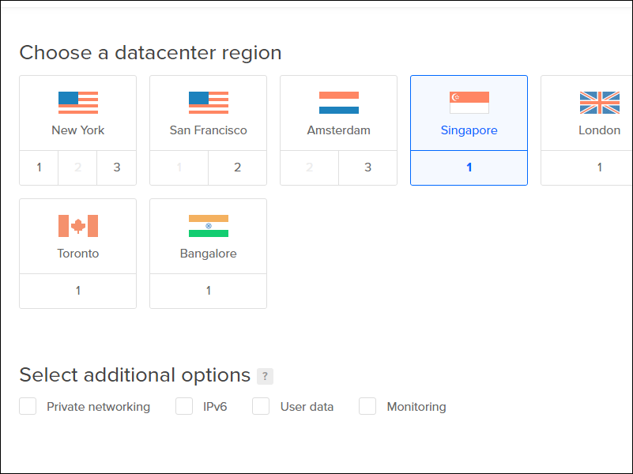

# Install V2ray + WebSocket + TLS + Caddy + CDN Using 233boy Script

## Why This Script?

V2Ray is the second most popular proxy software after Shadowsocks/ShadowsocksR, but the configuration is slightly complicated. The 233boy/v2ray script was written to make installation easier and more convenient for newbies. The source is located on Github at https://github.com/233boy/v2ray. It supports most features of V2Ray, including various transport protocols, WebSocket + TLS, HTTP/2, Shadowsocks, dynamic ports, integrated BBR, and speed optimization.

## Before You Begin

Before you download and run the script, you will need to:

* Open an account with a VPS provider. We will use the example of Digital Ocean, but you can choose another VPS provider if you prefer, e.g. Bandwagon Host.
* Have an account with Freenom. Do not worry if you do not have one. The Freenom site will step you through creating an account when you register your first domain name.
* Open an account with Cloudflare.
* Install a terminal emulator on your PC. We will use XSHELL 6 from NetSarang. They offer a free license for home and school users. You could alternatively use PuTTY.
* Assuming you have a Windows PC, download and unzip the v2rayN-Core.zip V2RayN GUI client for Windows from Github.
* Download and install Firefox browser, which we will use for connecting through V2RayN to the VPS.

## Create VPS

Digital Ocean calls each VPS a "droplet." The author of the script, 233boy, recommends that you create your VPS with Debian 9 or later, or with a recent version of Ubuntu. This is because the Linux kernel versions 4.9 and later support the BBR congestion control algorithm. However, you can also use CentOS 7 if you prefer. The smallest size of VPS (1 GB of RAM) is fine. We will use the Singapore location. You can change the default server name to something more meaningful if you wish.

