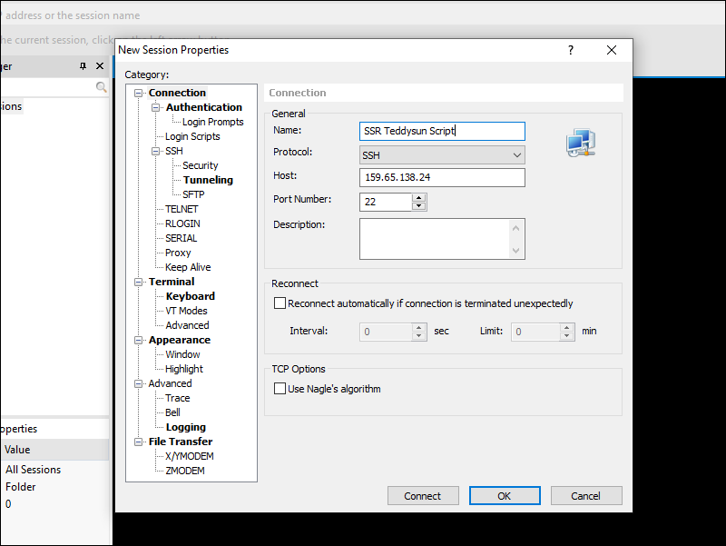
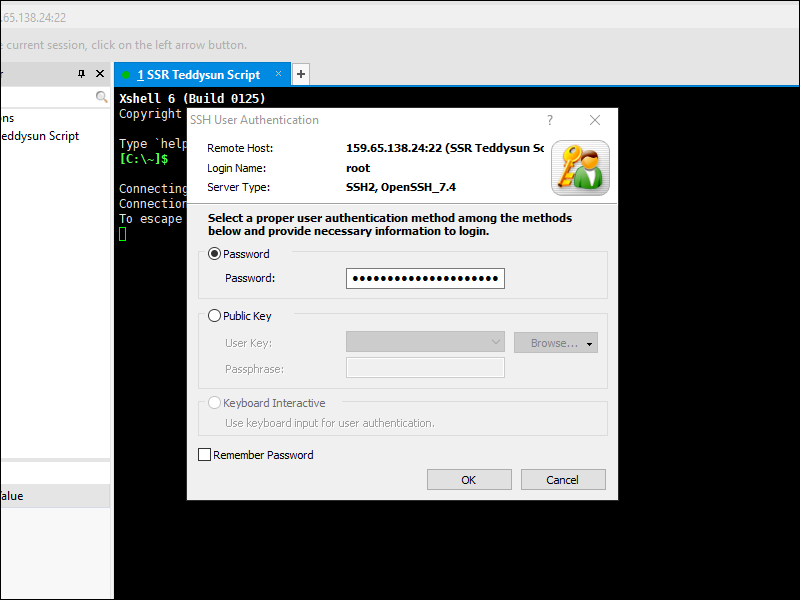

# Install ShadowsocksR Using Teddysun Script

## Why This Script?

This script simplifies the installation and configuration of a ShadowsocksR server. It can be run on a VPS running CentOS, Debian, or Ubuntu, and with as little as 128 MB of RAM.

## Before You Begin

Before you download and run the script, you will need to:

* Open an account with a VPS provider. We will use the example of Digital Ocean, but you can choose another VPS provider if you prefer, e.g. Bandwagon Host.
* Install a terminal emulator on your PC. We will use XSHELL 6 from NetSarang. They offer a free license for home and school users. You could alternatively use PuTTY.
* Assuming you have a Windows PC, download and unzip the ShadowsocksR-win-4.9.0.zip client for Windows from [https://github.com/shadowsocksrr/shadowsocksr-csharp/releases](https://github.com/shadowsocksrr/shadowsocksr-csharp/releases).
* You can use Edge, Firefox, or Chrome to reach your server. We will use Firefox in this example.
* You are going to need two passwords, one as a new root password for your server, and one for your ShadowsocksR password. You can generate strong passwords at [https://strongpasswordgenerator.com/](https://strongpasswordgenerator.com/). Examples:

```
uWP5h3dD29t8jPB
m754aJkf8vE2W3H
```

## Create VPS

Digital Ocean calls each VPS a "droplet." This script can run on CentOS, Debian, or Ubuntu. The smallest size of droplet (1 GB of RAM) is more than enough. In this post, we will use a CentOS 7 droplet and the Singapore location. 

## Login to VPS for First Time

Digital Ocean emails you the root password to use for your initial login. 

Open XSHELL 6. Add a new session, with protocol SSH, the host being your server IP address, and port 22. 



Click Connect to SSH into your VPS. The first time you connect to a new server, you must Accept and Save its host key. The user name on Digital Ocean is `root`. 


The initial password was in your email from Digital Ocean. 



You must change the initial password the first time you login. You can use one of your strong passwords from above, e.g.:

```
uWP5h3dD29t8jPB
```

## Update System and Install Prerequisites

As well as updating the system, we also need to install wget if it is not already installed.

For Debian or Ubuntu users:

```
apt update
apt upgrade
apt install wget
```

For CentOS users:

```
yum update
yum install wget
```

## Download and Run Script

Downloading and invoking the script is just three commands. 

Get the script from Github:


```
wget --no-check-certificate https://raw.githubusercontent.com/teddysun/shadowsocks_install/master/shadowsocksR.sh
```

Make the script executable:

```
chmod +x shadowsocksR.sh
```

Execute the script:

```
./shadowsocksR.sh 2>&1 | tee shadowsocksR.log
```


## Details of Script

The script prompts you to enter a password for ShadowsocksR. You can use one of your strong passwords from above, e.g.:

```
m754aJkf8vE2W3H
```

The script generates a random port number. You can either press **Enter** to leave the generated port number as it is, or enter a port number of your own choice.

You are asked to choose a stream cipher for ShadowsocksR:

```
1) none
2) aes-256-cfb
3) aes-192-cfb
4) aes-128-cfb
5) aes-256-cfb8
6) aes-192-cfb8
7) aes-128-cfb8
8) aes-256-ctr
9) aes-192-ctr
10) aes-128-ctr
11) chacha20-ietf
12) chacha20
13) salsa20
14) xchacha20
15) xsalsa20
16) rc4-md5
```

You can either press **Enter** to leave the cipher at the default of `aes-256-cfb`, or enter a cipher of your own choice.

You are asked to choose a protocol for ShadowsocksR:

```
1) origin
2) verify_deflate
3) auth_sha1_v4
4) auth_sha1_v4_compatible
5) auth_aes128_md5
6) auth_aes128_sha1
7) auth_chain_a
8) auth_chain_b
9) auth_chain_c
10) auth_chain_d
11) auth_chain_e
12) auth_chain_f
```

You can either press **Enter** to leave the protocol as the default of `origin`, or enter a protocol of your own choice.

You are asked to choose an obfuscation technique for ShadowsocksR:

```
1) plain
2) http_simple
3) http_simple_compatible
4) http_post
5) http_post_compatible
6) tls1.2_ticket_auth
7) tls1.2_ticket_auth_compatible
8) tls1.2_ticket_fastauth
9) tls1.2_ticket_fastauth_compatible
```

You can either press **Enter** to leave obfuscation at the default of `plain`, or enter an obfuscation technique of your own choice.

A message then appears:

```
Press any key to start...or Press Ctrl+C to cancel
```

* If you press **Ctrl**+**c**, the script will stop at this point. 
* If you press **Enter**, it will carry on with the installation and configuration of ShadowsocksR.

When the script finishes running, it displays a summary. For example:

```
Your Server IP        :  159.65.138.24 
Your Server Port      :  10596
Your Password         :  m754aJkf8vE2W3H 
Your Protocol         :  origin 
Your obfs             :  plain 
Your Encryption Method:  aes-256-cfb 
```

Make a note of these values. You will need them on the client.


Technical note: Behind the scenes, the script has placed these values in a file named `/etc/shadowsocks.json`. Its contents will look something like this:

```
{
    "server":"0.0.0.0",
    "server_ipv6":"[::]",
    "server_port":10596,
    "local_address":"127.0.0.1",
    "local_port":1080,
    "password":"m754aJkf8vE2W3H",
    "timeout":120,
    "method":"aes-256-cfb",
    "protocol":"origin",
    "protocol_param":"",
    "obfs":"plain",
    "obfs_param":"",
    "redirect":"",
    "dns_ipv6":false,
    "fast_open":false,
    "workers":1
}
```

## Client

We will use shadowsocksr-csharp, release ShadowsocksR-win-4.9.0, as our client. 

* For >= Windows 8 or with .NET 4.0, use ShadowsocksR-dotnet4.0.exe.
* For <= Windows 7 or with .NET 2.0, use ShadowsocksR-dotnet2.0.exe.

After you launch ShadowsocksR-win-4.9.0, the icon to open the ShadowsocksR control panel is in the system tray, which is at the bottom right of your Windows desktop. Right-click on it, then select **Servers** > **Edit Servers**. Enter the values that match your server configuration. 


Click **OK**.

Now open your browser. We will use Firefox as an example. Since ShadowsocksR defaults to Global mode, there is no need to change the proxy settings in Firefox itself.

Check your IP address on a site such as [https://ipchicken.com](https://ipchicken.com)

## Support

ShadowsocksR is no longer supported.
