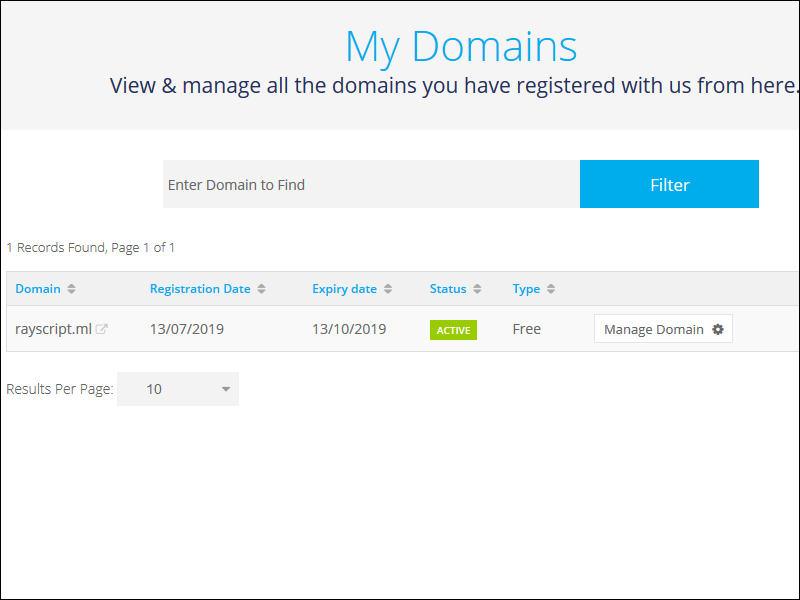
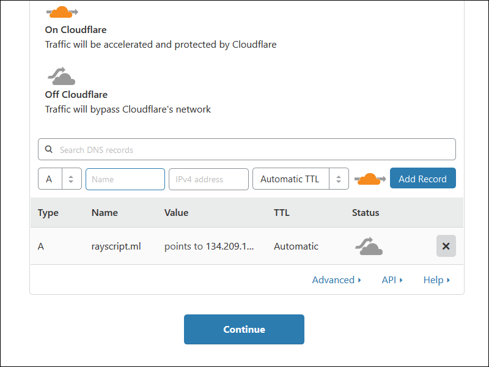
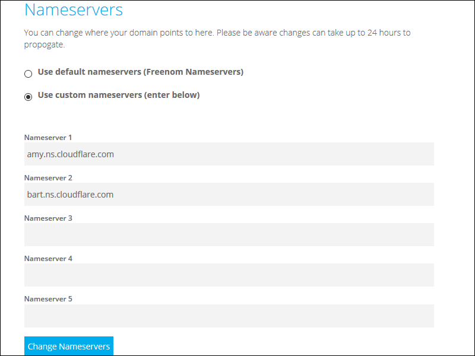
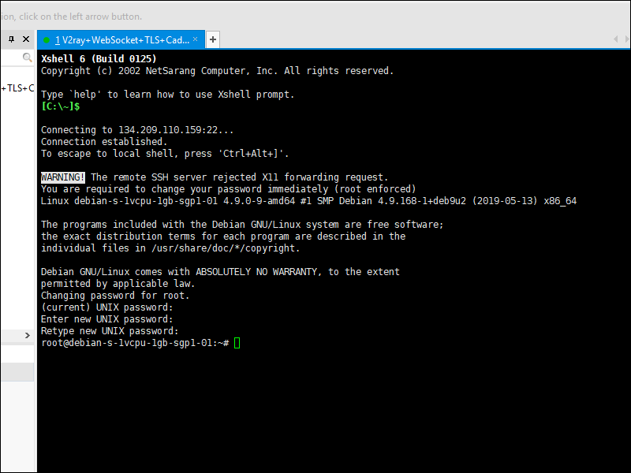
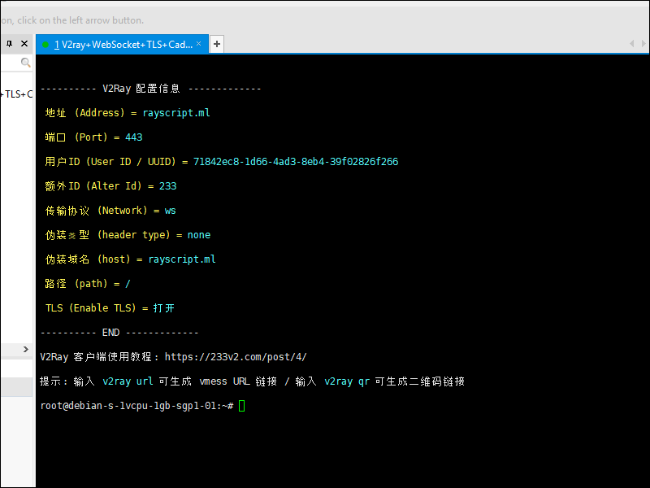
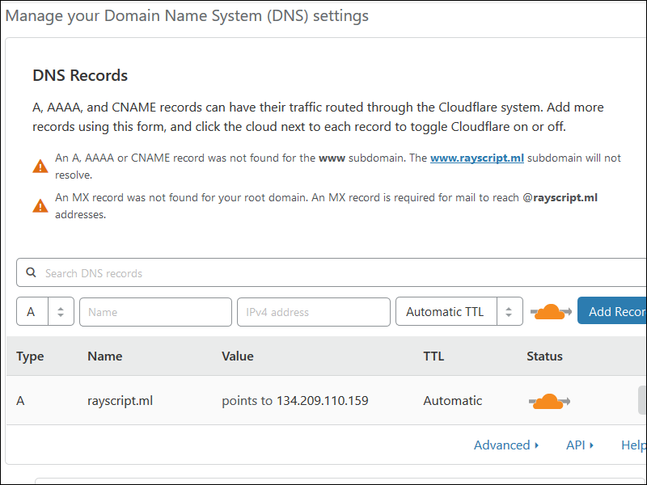
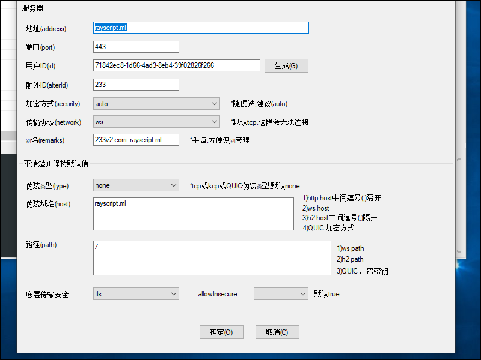
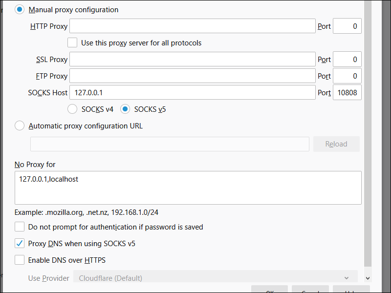
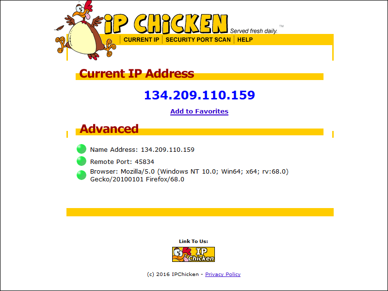

# Install V2Ray + WebSocket + TLS + Caddy + CDN Using 233boy Script

## Why This Script?

V2Ray is the most popular proxy software after Shadowsocks and ShadowsocksR, but the configuration is slightly complicated. The 233boy/v2ray script was written to make installation easier and more convenient for newbies. The source is located on Github at [https://github.com/233boy/v2ray](https://github.com/233boy/v2ray). It supports most features of V2Ray, including various transport protocols, WebSocket + TLS, HTTP/2, Shadowsocks, dynamic ports, integrated BBR, and speed optimization.

## Before You Begin

Before you download and run the script, you will need to:

* Open an account with a VPS provider. We will use the example of Digital Ocean, but you can choose another VPS provider if you prefer, e.g. Bandwagon Host.
* Have an account with Freenom. Do not worry if you do not have one. The Freenom site will step you through creating an account when you register your first domain name.
* Open an account with Cloudflare.
* Install a terminal emulator on your PC. We will use XSHELL 6 from NetSarang. They offer a free license for home and school users. You could alternatively use PuTTY.
* Assuming you have a Windows PC, download and unzip the v2rayN-Core.zip V2RayN GUI client for Windows from Github.
* Download and install Firefox browser, which we will use for connecting through V2RayN to the VPS.

## Create VPS

Digital Ocean calls each VPS a "droplet." The author of the script, 233boy, recommends that you create your VPS with Debian 9 or later, or with a recent version of Ubuntu. This is because the Linux kernel versions 4.9 and later support the BBR congestion control algorithm. However, you can also use CentOS 7 if you prefer. The smallest size of VPS (1 GB of RAM) is fine. We will use the Singapore location. You can change the default server name to something more meaningful if you wish.


## Get Domain Name

On the Freenom website , take out your choice of domain name. When you check for availability, the choices for free top-level domains (TLD) are tk, ml, ga, cf, and gq. The default duration of the free domain names is 3 months before renewal, but you can change this to 12 months before renewal if you wish. If you are using Freenom for the first time, you can create your account with your email address, or you can use a social login. If you use an email address, you will need to click a link in the verification email Freenom sends you. We will use an example domain of rayscript.ml.



## Add Domain Name to Cloudflare

Go to the Cloudflare website, and log in to your account. Add your new site to Cloudflare. Select the free plan. The Cloudflare DNS query will return nothing because you did not add any DNS records yet. Therefore add a DNS type A record in Cloudflare pointing to your VPS IPv4 address. 

The orange cloud icon means the site is active on Cloudflare. Temporarily click the orange icon under Status to make it go gray. This means Cloudflare will do only DNS resolution for now.



Cloudflare will inform you of the two nameservers to use. Our examples are `amy.ns.cloudflare.com` and `bart.ns.cloudflare.com`.

## Change Nameservers to Cloudflare

Back on Freenom, select your site, and click Manage Domain. Under Management Tools, click Nameservers. Change the nameservers to the two custom nameservers provided to you by Cloudflare.



Cloudflare will wait for the nameserver change to propagate. A message says this can take up to 24 hours, but it is usually much less. You will get an email when your domain name is active on Cloudflare.

## Login to VPS for First Time

Digital Ocean emails you the root password to use for your initial login. 

Open XSHELL 6. Add a new session, with protocol SSH, the host being your server IP address, and port 22. Click Connect to SSH into your VPS. The first time you connect to a new server, you must Accept and Save its host key. The user name on Digital Ocean is root. The initial password was in your email from Digital Ocean. You must change the initial password the first time you login.



For Debian or Ubuntu users, update your system and install curl like this:

```
apt update
apt upgrade
apt install curl
```

For CentOS users, update your system and install curl like this:

```
yum update
yum install curl
```

## Download and Run Script

Downloading and invoking the script is just a single command:

```
bash <(curl -s -L https://git.io/v2ray.sh)
```

## Details of Script

First you are asked if you want to install or uninstall:

```
 1. 安装 (Install)
 2. 卸载 (Uninstall)
 ```

Type **1** to install, then press **Enter**.

Next you are asked which function you want:

```
  1. TCP
  2. TCP_HTTP
  3. WebSocket
  4. WebSocket + TLS
  5. HTTP/2
  6. mKCP
  7. mKCP_utp
  8. mKCP_srtp
  9. mKCP_wechat-video
 10. mKCP_dtls
 11. mKCP_wireguard
 12. QUIC
 13. QUIC_utp
 14. QUIC_srtp
 15. QUIC_wechat-video
 16. QUIC_dtls
 17. QUIC_wireguard
 18. TCP_dynamicPort
 19. TCP_HTTP_dynamicPort
 20. WebSocket_dynamicPort
 21. mKCP_dynamicPort
 22. mKCP_utp_dynamicPort
 23. mKCP_srtp_dynamicPort
 24. mKCP_wechat-video_dynamicPort
 25. mKCP_dtls_dynamicPort
 26. mKCP_wireguard_dynamicPort
 27. QUIC_dynamicPort
 28. QUIC_utp_dynamicPort
 29. QUIC_srtp_dynamicPort
 30. QUIC_wechat-video_dynamicPort
 31. QUIC_dtls_dynamicPort
 32. QUIC_wireguard_dynamicPort
```

Select **4** for WebSocket + TLS, and press **Enter**.

```
请输入 V2Ray 端口 [1-65535]，不能选择 80 或 443 端口
(默认端口: 62864):
```

In the lines above, you are being asked for a port number. Press **Enter** to accept the generated value, which in our example is `62864`.

```
请输入一个 正确的域名，一定一定一定要正确，不！能！出！错！
(例如：233blog.com): 
```

In the lines above, you are asked for a host name, such as `233blog.com`. Our host name is `rayscript.ml`. After your have typed your host name, press **Enter**.

```
请将 rayscript.ml 解析到: 134.209.110.159
请将 rayscript.ml 解析到: 134.209.110.159
请将 rayscript.ml 解析到: 134.209.110.159

(是否已经正确解析: [Y]):
```

In the lines above, you are asked if the host name resolution is correct. Assuming it is, put **y** for yes.

```
安装 Caddy 来实现 自动配置 TLS
如果你已经安装 Nginx 或 Caddy
并且..自己能搞定配置 TLS
那么就不需要 打开自动配置 TLS

(是否自动配置 TLS: [Y/N]):
```

In the lines above, you are asked if you want to automatically configure TLS. Put **y** for yes.

```
是否开启 网站伪装 和 路径分流 [Y/N]
(默认: [N]):
```

In the lines above, you are asked if you want website camouflage. Put the default **n** for no.

```
是否开启广告拦截(会影响性能) [Y/N]
(默认 [N]):
```

In the lines above, you are asked if you want ad blocking (which will affect performance). Put the default **n** for no.

```
是否配置 Shadowsocks [Y/N]
(默认 [N]): 
```

In the lines above, you are asked whether you want to configure Shadowsocks. Put the default **n** for no.

```
....准备安装了咯..看看有毛有配置正确了...
---------- 安装信息 -------------
V2Ray 传输协议 = WebSocket + TLS
V2Ray 端口 = 62684
你的域名 = rayscript.ml
域名解析 = 我确定已经有解析了
自动配置 TLS = 打开
是否配置 Shadowsocks = 未配置
---------- END -------------
按 Enter 回车键 继续....或按 Ctrl + C 取消.
```

In the sample output above, your installation choices are redisplayed for you to confirm. Press **Enter** to confirm your choices or **Ctrl**+**c** to cancel. Assuming you press **Enter**, the installation script then runs. At the end of the run, the parameters for the client are displayed. For example:

```
---------- V2Ray 配置信息 -------------
地址 (Address) = rayscript.ml
端口 (Port) = 443
用户ID (User ID / UUID) = 71842ec8-1d66-4ad3-8eb4-39f02826f266
额外ID (Alter Id) = 233
传输协议 (Network) = ws
伪装类型 (header type) = none
伪装域名 (host) = rayscript.ml
路径 (path) = /
TLS (Enable TLS) = 打开
---------- END -------------
V2Ray 客户端使用教程: https://233v2.com/post/4/
提示: 输入 v2ray url 可生成 vmess URL 链接 / 输入 v2ray qr 可生成二维码链接
```



At this point, you can enter:

```
v2ray url
```

to generate a Vmess URL link. For example:

```
vmess://ewoidiI6ICIyIiwKInBzIjogIjIzM3YyLmNvbV9yYXlzY3JpcHQubWwiLAoiYWRkIjogInJheXNjcmlwdC5tbCIsCiJwb3J0IjogIjQ0MyIsCiJpZCI6ICI3MTg0MmVjOC0xZDY2LTRhZDMtOGViNC0zOWYwMjgyNmYyNjYiLAoiYWlkIjogIjIzMyIsCiJuZXQiOiAid3MiLAoidHlwZSI6ICJub25lIiwKImhvc3QiOiAicmF5c2NyaXB0Lm1sIiwKInBhdGgiOiAiLyIsCiJ0bHMiOiAidGxzIgp9Cg==
```

You can also enter:

```
v2ray qr 
```

to generate a link to a page with a QR code. For example:

```
https://233boy.github.io/tools/qr.html#vmess://ewoidiI6ICIyIiwKInBzIjogIjIzM3YyLmNvbV9yYXlzY3JpcHQubWwiLAoiYWRkIjogInJheXNjcmlwdC5tbCIsCiJwb3J0IjogIjQ0MyIsCiJpZCI6ICI3MTg0MmVjOC0xZDY2LTRhZDMtOGViNC0zOWYwMjgyNmYyNjYiLAoiYWlkIjogIjIzMyIsCiJuZXQiOiAid3MiLAoidHlwZSI6ICJub25lIiwKImhvc3QiOiAicmF5c2NyaXB0Lm1sIiwKInBhdGgiOiAiLyIsCiJ0bHMiOiAidGxzIgp9Cg==
```

Type:

```
v2ray status
```

to make sure both V2Ray and Caddy are running:

```
V2Ray 状态: 正在运行  /  Caddy 状态: 正在运行
```

## Enable Cloudflare

On the Cloudflare site, on the **DNS** tab for your site, click the gray icon under Status to make the cloud go orange. This means Cloudflare is active for HTTP proxying as well as DNS resolution.



Go to the **Crypto** tab. Set SSL to **Off**. Then set SSL back to **Full**. Make sure you see Universal SSL Status: Active Certificate.

## Client

We will use V2RayN on Windows as our client. After you launch V2RayN, the icon to open the V2RayN control panel is in the system tray, which is at the bottom right of your Windows desktop. From the Server (服务器) menu, select either:

* Import URL from clipboard (从剪贴板导入批量URL)
* Scan the QR code on the screen (扫描屏幕上的二维码)

These correspond to the server commands `v2ray url` and `v2ray qr`. Whichever method you choose, your server parameters are imported. 



Click the Open button. In the box at the bottom of the V2RayN window, messages appear such as:

```
配置成功
Vmess-233v2.com_rayscript.ml(***ml:443)
启动服务(7/13/2019 7:23:51 AM)......
V2Ray 4.18.0 (Po) 20190228
A unified platform for anti-censorship.
2019/07/13 07:23:52 [Warning] v2ray.com/core: V2Ray 4.18.0 started
```

Now open Firefox. In the menu in the top right corner, click **Options**. Scroll down to the bottom, and where you see Network Settings, click **Settings**. Select **Manual proxy configuration**. In SOCKS Host put `127.0.0.1`. For Port put `10808`, which is the port V2RayN now uses. Select **SOCKS v5**. Select **Proxy DNS when using SOCKS v5**. Press **OK** to save your settings. Close the `about:preferences` tab.



Check your IP address on a site such as [https://ipchicken.com](https://ipchicken.com)



## Support

Post your issue on [https://github.com/233boy/v2ray/issues](https://github.com/233boy/v2ray/issues).
